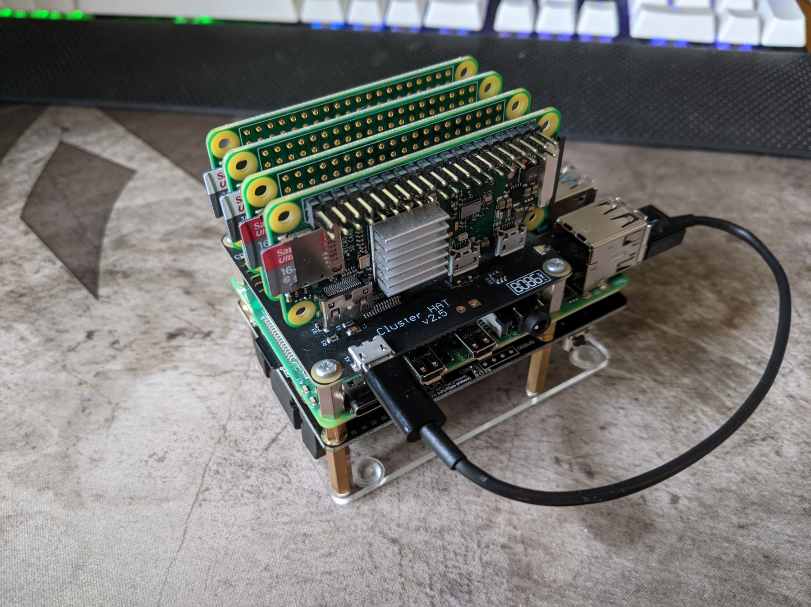
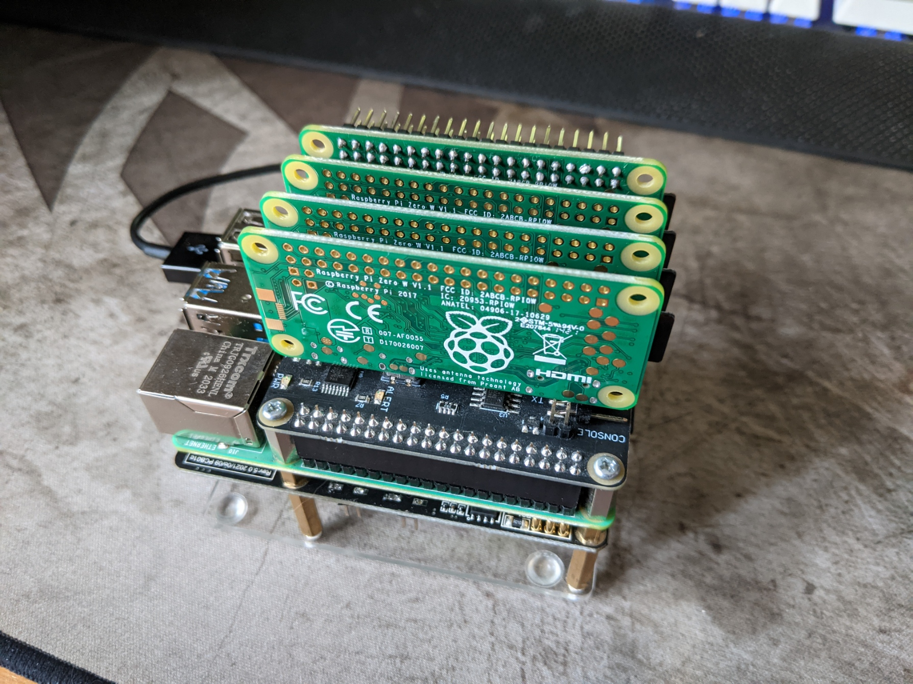

# ClusterHat-Docker-Kubernetes-Server
Hello, this repository for setting up a raspberry server using a cluster hat, a ups and docker or kubernetes

# Components
the components used within this repository are:  
1x Raspberry Pi 8gb  
4x Raspberry Pi 0  
1x CluasterHat  
1x Raspberry Pi UPS V5 UPS Plus  
1x 3D printed Case  
2x Arcylic Sheets  
4x Fans  
5x microSD  
2x 18650 batteries
# Assembly
When it comes to assembling the whole thing it is pretty simple. First you need assemble all the electronics. which can be seen in the images below.
### Fully Built Electronics
Underneath  
  
Front  
  
Back  
  
### OS
Now you need to place the raspbian os the can found on https://clusterhat.com/ on each of the microSD with an imager. I use the raspberry pi image from the raspberry pi website https://www.raspberrypi.org/software/.  
### Case
After this we need to connect the 4 fans with soldering to allow it to be attached to the clusterHat board.  
Next thing to do is 3d print the case in which the server will be held in. Once this is 3D printed, screw in the 4 fans like shown in the image below.  
  

  

# Setup #
### VNC
Once everything is fully assembled and the right OS is on each of the Raspberry Pis. Plug in a monitor, keyboard and mouse into the Raspberry Pi 4b so you can follow the initial setup guide given on (link gone).  
After this the first thing to do is to download vnc veiwer so you can interact with the Raspberry Pi 4b without needing a seperate moitor, mouse and keyboard. Once that is done we can start the next stuff.  
### SSH 
If instead you want to use SSH to connect to your Raspberry Pi 4b that also works. I recommend using PuTTY if you'v never done it before.

### CusterHAT
# Docker Swarm
what is docker? docker is a online service that uses containers to allow quick and simple 
