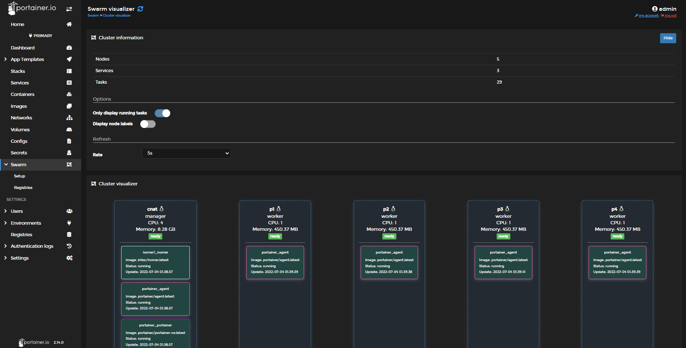
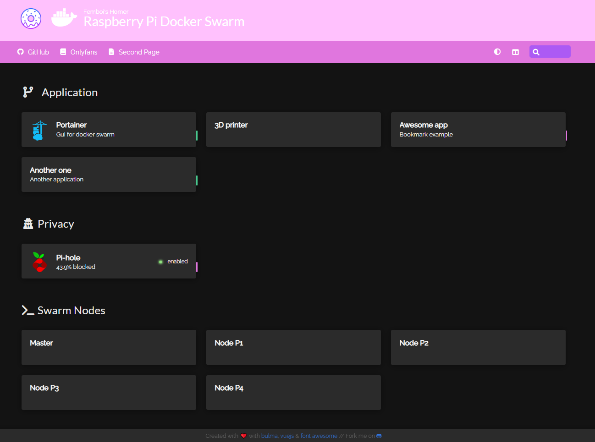
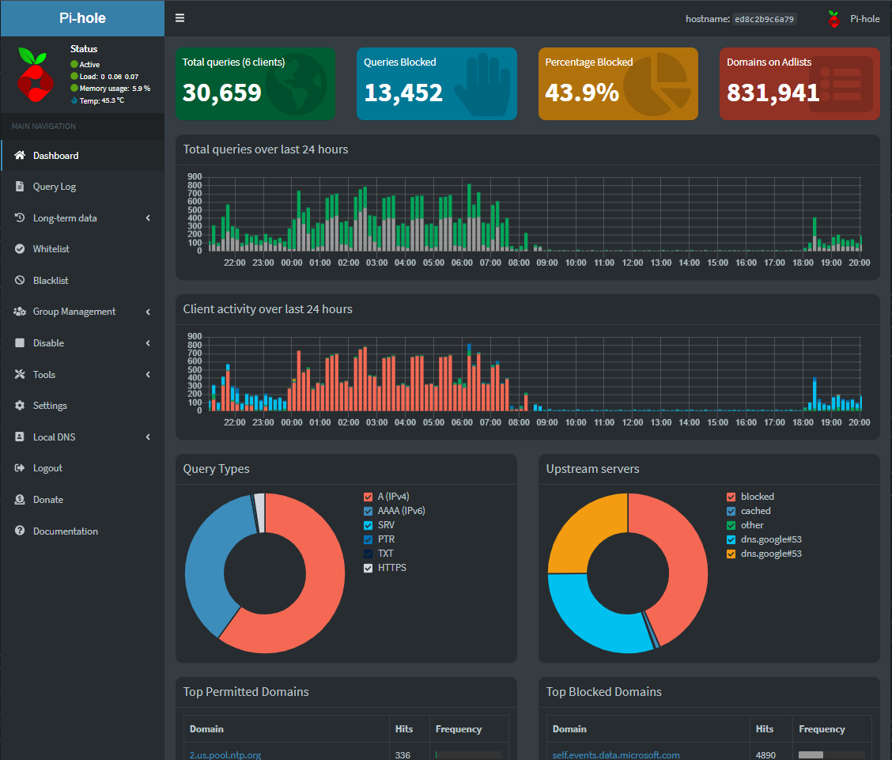

# ClusterHat-Server CBRIDGE
Hello, I made this repository for setting up a raspberry server using a cluster hat, a ups. I am by no means confident in what I write, I'm currently in the process of learning it as well. However, if any of it is able to someone then that makes me happy. 
Hopefully I will be useful to maintain this and keep it up to date.

# Components
the components used within this repository are:  
1x Raspberry Pi 8gb  
4x Raspberry Pi 0  
1x CluasterHat  
1x Raspberry Pi UPS V5 UPS Plus  
1x 3D printed Case  
2x Arcylic Sheets  
4x Fans  
5x microSD  
2x 18650 batteries  
1x OLED screen

# Assembly
When it comes to assembling the whole thing it is pretty simple. First you need assemble all the electronics. which can be seen in the images below.
### Fully Built Electronics
Underneath  
  
Front  
  
Back  
  
### OS
Now you need to place the raspbian os the can found on https://clusterhat.com/ on each of the microSD with an imager. I use the raspberry pi image from the raspberry pi website https://www.raspberrypi.org/software/.  
### Case
When it came to the case. It was designed using solidworks and the image below shows the model.   
  
The files can be found under the CAD folder for 3D printing. After this we need to connect the 4 fans with soldering to allow it to be attached to the clusterHat board. In the image below it shows where on the board the pins where the fans will be connected to. It shows underneath the board which pin is positive or negative.
The screws supplied with the fans need to be filed down due to being too long. If left too long when moving the cluster in and out the screws collide with the sd cards.


  

# Setup #
### VNC
Once everything is fully assembled and the right OS is on each of the Raspberry Pis. Plug in a monitor, keyboard and mouse into the Raspberry Pi 4b so you can turn on vnc within the preferences.  
After this the first thing to do is to download vnc veiwer on your main computer so you can interact with the Raspberry Pi 4b without needing a seperate monitor, mouse and keyboard. Once that is done we can start the next stuff.  
### SSH 
If instead you want to use SSH to connect to your Raspberry Pi 4b that also works. This can be done while burning the image onto the microSD card using Pi Imager. I recommend using PuTTY if you've never done it before.


# CusterHAT
In order to setup the ClusterHAT correctly, you'll be to run the command below on the terminal.
```
clusterhat on
```
this will power all the zeros on the ClusterHAT. This will be indicated by the orange PWR LEDS coming on as well as the blue LED indicating the ClusterHAT board is performing an action.
if you want to apply power to specific Pi zeros, you'll need add the Pi Zero at the end. The example below is for P1
```
clusterhat on p1
```
To switch it off:
```
clusterhat off
clusterhat off p1
```
## Fans
The ClusterHAT board has a couple pins dedicated for a fan, but this is not on by default so you'll need to change your ```/boot/config.txt``` file and add the following to the bottom
```shell
dtoverlay=gpio-fan,gpiopin=18,temp=75000 #this is 75 degrees C
```
Note that the 2000 I put means 20 degree celecius. So when the CPU temperature is above 20 degrees, the fans come on.
# Docker Swarm
What is docker? docker is a online service that uses containers to allow quick and simple depployment of software on a metaphorical port, in this case, the server. What is a container? A container is a stanardized box that has everything necessary to run the programs within the container. Imagine how containers can easily stack on top and next to one another on a freight ships. Each container looks exactly the same of the outside but the inside could be anything.

Now that I have given a brief overview of Docker and containers. Now we can talk about Docker Swarm. This is when we have multiple computers running the same containers or we can specify a container to run specifically on one node

to setup the Docker swarm, all you need to do is download Docker and write in the terminal on the computer you want to be the manager.
```
docker swarm init
```
Once that is done, you'll be shown a command to run in the terminals of the computers you want to add to the swarm.

each node can join the swarm by writing this command in the command shell
```
docker swarm join --token [very long token goes here]
```
# Portainer
Portainer is a useful container managemnet GUI for docker, docker swarm and kubernetes.

Portainer also has a list of templates that allow you to easily and quickly deploy containers. However, the list is pretty small. So you can go into settings and replace link with one these. I'm currently using the last one.

here is the links to the lists of templates.

In addition, Portainer also has a nice visualization for Docker Swarm. Here is an example of what it currently looks like while I'm writing this.
  

https://docs.portainer.io/start/install/server/swarm/linux

# Homer
homer is a full static hmtl/js dashboard generator. I used this to take the webpage for the whole server so I can access all the applications I have running as well as access to other applications on my local internet such as my 3D printer.

When it came to using Docker direclty did not work for me. Creating a docker-compose.yml file did not work for me either because it told me "it does not support that version". What did work for me was creating a stack on Portainer and writing in the same docker-compose.yml file. In addition, when it did work I noticed it did not have a port set for it because I deployed it to the swarm in general. So I altered the docker-compose file to specify I want it purely on the Pi 4 and that allowed me to access it.. 

In order to change how it looks, you'll need to set a path to find the necessary files on the host. In the image below you will see where you need to add a path.

Once you've done that, you can place the config.yml file there and all the necessary additions such as images and css files.
  

# PiHole
One of the things I have running on the server is Pihole, Currently on the main Pi 4B. I tried running it on the zeros but due to how the IP address was done internally. It would not work. In the future I will try and have this on Docker or Kubernetes so that it can run on the zeros without issue.

  

All you have to do is go to the PiHole wesbite/Github and run
```
curl -sSL https://install.pi-hole.net | bash
```
This can be done as well as by deploying the container that hosts PiHole as well
Which is what I will be doing in the future
# WireGuard
Another is Wireguard which allows you to create a VPN server which you can connect your mobile phone and Computer to use the PiHole on the go. So no matter where you are. You'll be place where your house is. especially useful if accessing potentially risky public internet spots.


here is a link to a github repository for installing pihole and wireguard.
https://github.com/IAmStoxe/wirehole

# 3D printer
I recently added a Raspberry Pi 3b to my 3D printer to make it smarter and to be able to control it from away from home

i added it to the docker swarm.

I then added a docker container for fluidd via docker compose and used KIAUH  
https://www.lpomykal.cz/kiauh-klipper-installation/  
https://hub.docker.com/r/cadriel/fluidd  
https://github.com/th33xitus/kiauh
